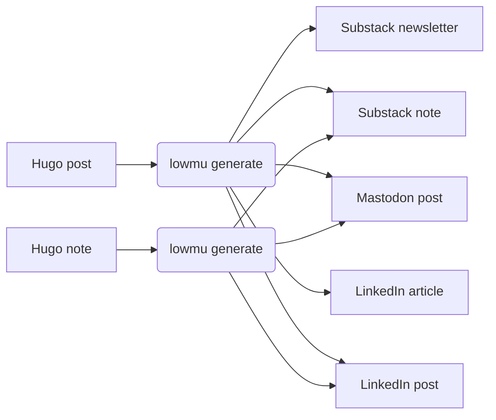

# lowmu

A Ruby CLI that lowers the friction of publishing blog posts and related
content to the social web. Write once, publish everywhere.

The name "lowmu" is a play on "low friction" and the Greek letter "mu" (μ),
which represents the coefficient of friction in physics.

## What it does



lowmu reads your Hugo content directory, uses AI to adapt each post for each
target platform (length and tone), and writes the generated files to a local
content store. You review and edit the output, then publish.

## Quick install

```bash
git clone https://github.com/grymoire7/lowmu.git
cd lowmu
bundle install
```

## Configuration

Run the configuration wizard to create `~/.config/lowmu/config.yml`:

```bash
lowmu configure
```

Example config:

```yaml
# lowmu configuration file
# Generated by `lowmu configure`

# Hugo content root (posts and notes live as subdirectories here)
hugo_content_dir: ~/projects/myblog/content

# Which subdirectories are long-form posts (default: [posts])
post_dirs: [posts]

# Which subdirectories are short-form notes (default: [notes])
note_dirs: [notes]

# Directory where generated content is stored (default: .lowmu)
# content_dir: .lowmu

# LLM configuration for AI-assisted content generation
llm:
  provider: anthropic
  model: claude-sonnet-4-6

# Generation targets (no auth needed — you post manually)
# Valid types: linkedin_long, linkedin_short, substack_long, substack_short, mastodon_short
targets:
  - linkedin_long
  - linkedin_short
  - substack_long
  - substack_short
  - mastodon_short

# Author persona for brainstorm command (used in LLM prompts)
# persona: |
#   I write about software engineering, developer tools, and productivity.
#   My audience is experienced developers who value depth over hype.

# Sources for brainstorm command
# sources:
#   - type: rss
#     url: https://example.com/feed.xml
#     name: example-blog
#   - type: file
#     path: ~/notes/ideas.md
#     name: my-ideas
```

## Usage

```bash
# Check generation status for all posts (tabular view per target)
lowmu status

# Filter status output
lowmu status --pending        # at least one output pending
lowmu status --done           # all applicable outputs done
lowmu status --stale          # at least one output stale
lowmu status --recent 1w      # source or output touched within 1 week

# Check status of a specific post
lowmu status long/my-post-slug

# Generate for a specific post
lowmu generate long/my-post-slug

# Generate for posts modified in the last week
lowmu generate --recent 1w

# Generate for a specific target only
lowmu generate long/my-post-slug --target mastodon_short

# Force regeneration even if already generated
lowmu generate long/my-post-slug --force
```

Generated files are written to `content_dir/generated/<section>/<slug>/` for review before publishing.

### Brainstorm

Generate content ideas from RSS feeds and local markdown files:

```bash
# Generate 5 long-form ideas (default)
lowmu brainstorm

# Generate 3 short-form ideas (~500 word drafts)
lowmu brainstorm --form short --num 3

# Reprocess all source items, ignoring previously seen state
lowmu brainstorm --rescan
```

Ideas are written to `hugo_content_dir/ideas/` as markdown files with YAML front matter. Previously seen source items are tracked in `.lowmu/brainstorm_state.yml` and skipped on subsequent runs.

Configure `persona` and `sources` in your config file to use this command (see Configuration above).


## Development

```bash
bundle exec rspec          # Run tests
bundle exec standardrb     # Code style checks
bundle exec standardrb --fix  # Auto-fix style issues
```

This project uses [Standard Ruby](https://github.com/standardrb/standard) for
formatting and [Conventional Commits](https://www.conventionalcommits.org/) for
commit messages.

## Credits

Created by [Tracy Atteberry](https://tracyatteberry.com) using:
- [Ruby](https://www.ruby-lang.org/) — Programming language
- [Thor](https://github.com/rails/thor) — CLI framework
- [RubyLLM](https://github.com/crmne/ruby_llm) — AI service integration
- [front_matter_parser](https://github.com/waiting-for-dev/front_matter_parser) — Hugo front matter parsing
- [Claude AI](https://claude.ai) — Development assistance

## License

MIT License — see [LICENSE](LICENSE) for details.
