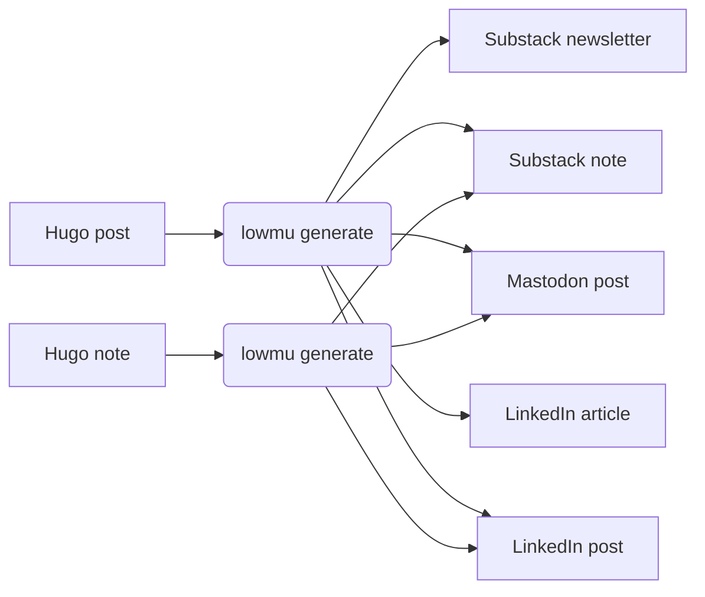

# lowmu

A Ruby CLI that lowers the friction of publishing blog posts and related
content to the social web. Write once, publish everywhere.

The name "lowmu" is a play on "low friction" and the Greek letter "mu" (μ),
which represents the coefficient of friction in physics.

## What it does



lowmu reads your Hugo content directory, uses AI to adapt each post for each
target platform (length and tone), and writes the generated files to a local
content store. You review and edit the output, then publish.

## Quick install

```bash
git clone https://github.com/grymoire7/lowmu.git
cd lowmu
bundle install
```

## Configuration

Run the configuration wizard to create `~/.config/lowmu/config.yml`:

```bash
lowmu configure
```

Example config:

```yaml
# lowmu configuration file
# Generated by `lowmu configure`

# Hugo content directory (source of truth for input)
hugo_content_dir: ~/projects/myblog/content/posts

# Directory where generated content is stored (default: .lowmu)
# content_dir: .lowmu

# LLM configuration for AI-assisted content generation
llm:
  provider: anthropic
  model: claude-sonnet-4-6

# Generation targets (no auth needed — you post manually)
targets:
  - name: blog
    type: hugo
    base_url: https://my-blog.com
    base_path: ~/projects/my-blog/content

  - name: substack
    type: substack

  - name: mastodon
    type: mastodon
    base_url: https://mastodon.social
  - name: linkedin
    type: linkedin
```

## Usage

```bash
# Check generation status of all posts
lowmu status

# Check status of a specific post
lowmu status my-post-slug

# Generate platform content for all posts
lowmu generate

# Generate for a specific post
lowmu generate my-post-slug

# Generate for a specific target only
lowmu generate my-post-slug --target mastodon

# Force regeneration even if already generated
lowmu generate my-post-slug --force
```

Generated files are written to `content_dir/<slug>/` for review before publishing.


## Development

```bash
bundle exec rspec          # Run tests
bundle exec standardrb     # Code style checks
bundle exec standardrb --fix  # Auto-fix style issues
```

This project uses [Standard Ruby](https://github.com/standardrb/standard) for
formatting and [Conventional Commits](https://www.conventionalcommits.org/) for
commit messages.

## Credits

Created by [Tracy Atteberry](https://tracyatteberry.com) using:
- [Ruby](https://www.ruby-lang.org/) — Programming language
- [Thor](https://github.com/rails/thor) — CLI framework
- [RubyLLM](https://github.com/crmne/ruby_llm) — AI service integration
- [front_matter_parser](https://github.com/waiting-for-dev/front_matter_parser) — Hugo front matter parsing
- [Claude AI](https://claude.ai) — Development assistance

## License

MIT License — see [LICENSE](LICENSE) for details.
